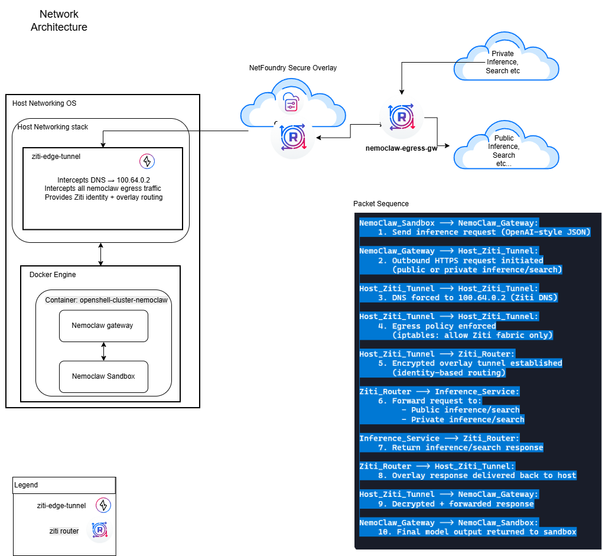
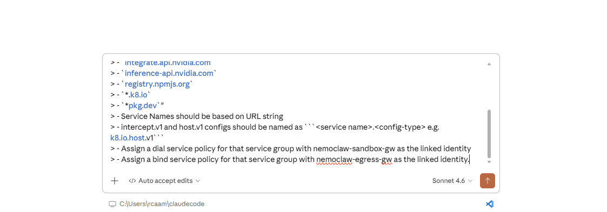
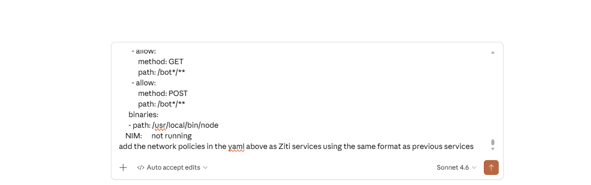
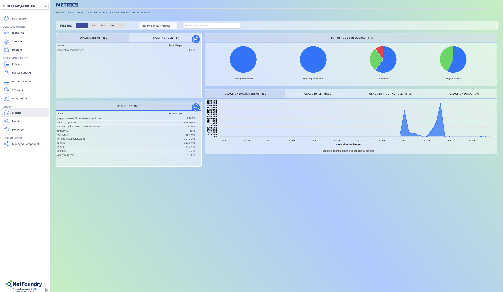

# Ziti-Nemoclaw Integration: AI-Managed Sandbox Security

This repository contains the scripts and system services demonstrating and example integration of **OpenZiti** (via NetFoundry) with the **NVIDIA Nemoclaw** gateway. 

## Project Overview

This project implements a **Policy-as-Code** model where an AI agent (via MCP) manages the network lifecycle of an NVIDIA sandbox. By running the Ziti Edge Tunnel at the host level, we separate **Infrastructure Noise** (onboarding/updates) from **Sandbox Moves** (inference), providing a surgical kill-switch and real-time telemetry.

---

## 1. Network & AI Prerequisites



### Create a NetFoundry V8 Network
1. Create a NetFoundry V8 Network with at least one **NF Hosted Edge Router**.
2. Follow the documentation at [NetFoundry Support](https://support.netfoundry.io/hc/en-us).

### Install & Configure an OpenZiti MCP Server
1. Follow instructions at [ziti-mcp-server GitHub](https://github.com/openziti/ziti-mcp-server).
2. **Note:** This example uses **Claude desktop code** as the MCP client.

### Initialize AI Service Template
Provide the following prompt to Claude to bootstrap your network logic:

> Please add the following to my Ziti Network:
> 1. A private edge-router named **nemoclaw-egress-gw** with `isTunnelerEnabled` set to true.
> 2. An identity client named **nemoclaw-sandbox-gw**. Download the JWT.
> 
> Add the following services ziti with the intercept.v1 set to forward address, protocol and port:
> - `ghcr.io`
> - `*.s3.dualstack.us-east-1.amazonaws.com`
> - `*.docker.io`
> - `integrate.api.nvidia.com`
> - `inference-api.nvidia.com`
> - `registry.npmjs.org`
> - `*.k8.io`
> - `*pkg.dev`"
> - Service Names should be based on URL string
> - intercept.v1 and host.v1 configs should be named as ```<service name>.<config-type> e.g. k8.io.host.v1```
> - Assign a dial service policy for that service group with nemoclaw-sandbox-gw as the linked identity
> - Assign a bind service policy for that service group with nemoclaw-egress-gw as the linked identity.



## 2. Turnup and register the private NetFoundry Edge-router (nemoclaw-egress-gw) 
   
   - 1. download image or deploy a public cloud vm [here](https://netfoundry.io/products/netfoundry-downloads/#zitirouters) 
   - 2. *Follow router registration instructions [here](https://support.netfoundry.io/hc/en-us/articles/360034337892-How-to-Register-the-Edge-Router-VM) 

***You will need to login to your network console at [CloudZiti](cloudziti.io) to get the associated registration key.**

---

## 3. Infrastructure Setup (Ubuntu 22.04+)

*Recommended: AWS c5.xlarge with 50GB Storage (Ubuntu 24.04 Server).*

### Update OS
```bash
sudo apt update && sudo apt upgrade -y
sudo apt install git -y
```

### Install Docker
```bash
sudo apt install -y ca-certificates curl gnupg
sudo install -m 0755 -d /etc/apt/keyrings
curl -fsSL https://download.docker.com/linux/ubuntu/gpg | sudo gpg --dearmor -o /etc/apt/keyrings/docker.gpg
echo \
  "deb [arch=$(dpkg --print-architecture) signed-by=/etc/apt/keyrings/docker.gpg] \
  https://download.docker.com/linux/ubuntu $(lsb_release -cs) stable" \
  | sudo tee /etc/apt/sources.list.d/docker.list > /dev/null

sudo apt update
sudo apt install -y docker-ce docker-ce-cli containerd.io
```

### Enable Docker
```bash
sudo systemctl enable --now docker
sudo usermod -aG docker $USER
# REBOOT: To apply any kernel updates and finalize group permissions
sudo reboot
```

---

## 4. Ziti Edge Tunnel Installation

1. Follow the [Official Debian/Ubuntu Tunneler Guide](https://netfoundry.io/docs/openziti/reference/tunnelers/linux/debian-package).
2. Place your `nemoclaw-sandbox-gw.jwt` into `/opt/openziti/etc/identities`.
3. Set permissions before restarting the service:
```bash
sudo chown ziti:ziti /opt/openziti/etc/identities/nemoclaw-sandbox-gw.jwt
sudo systemctl restart ziti-edge-tunnel
```

---

## 5. Repository Deployment & Watcher Service

```bash
mkdir -p ~/repos
cd ~/repos
git clone https://github.com/r-caamano/ziti-nemoclaw-integration

# Install the ziti-nemoclaw-watcher service
sudo cp ~/repos/ziti-nemoclaw-integration/services/ziti-nemoclaw-watcher.service /etc/systemd/system/
#Review scripts and services before running
sudo cp ~/repos/ziti-nemoclaw-integration/scripts/znemoclaw-watcher.sh /usr/local/bin/
sudo chmod 700 /usr/local/bin/znemoclaw-watcher.sh
sudo systemctl enable ziti-nemoclaw-watcher.service --now
```

---

## 6. NVIDIA Nemoclaw Implementation

1. **Obtain API Key:** Visit [NVIDIA Build API Keys](https://build.nvidia.com/settings/api-keys).
2. **Install Nemoclaw:**
```bash
curl -fsSL https://www.nvidia.com/nemoclaw.sh | bash # Follow default prompts and accept the recommended policy setup.
# Pickup the environment changes in the current shell
source ~/.bashrc
```
3. **Sync Policy with AI:**
```bash
nemoclaw my-assistant status #Outputs nemoclaw gateway current network policies in yaml format
```
> - Paste the above YAML output into Claude. 
> - Ask Claude to add the network policies as Ziti services using the template from Step 1. Tell it to skip any overlaps with existing.
nemoclaw my-assistant status


---

## 7. Operation & Monitoring

### Connect to the Sandbox
```bash
nemoclaw my-assistant connect
openclaw tui
```
*Converse with the openclaw agent in the interactive TUI.*

### Check NetFoundry Metrics
1. Log in to your **NetFoundry Account**.
2. Click **Metrics** in the left sidebar.
3. Review **Bytes Transmitted** per service to distinguish between:
    - **Infrastructure build / install:** (Onboarding/Updates).
    - **Sandbox Moves:** (Surgical Inference).


---
